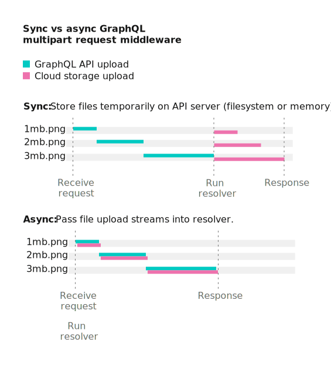

# GraphQL multipart request specification

[](https://github.com/jaydenseric/graphql-multipart-request-spec/releases)

An interoperable [multipart form](https://tools.ietf.org/html/rfc7578) field structure for GraphQL requests, used by various file upload client/server implementations.

It’s possible to implement:

- Nesting files anywhere within operations (usually in `variables`).
- Operation batching.
- File deduplication.
- File upload streams in resolvers.
- Aborting file uploads in resolvers.



## Multipart form field structure

An “operations object” is an [Apollo GraphQL POST request](https://www.apollographql.com/docs/apollo-server/requests.html#postRequests) (or array of requests if batching). An “operations path” is an [`object-path`](https://npm.im/object-path) string to locate a file within an operations object.

So operations can be resolved while the files are still uploading, the fields are ordered:

1.  `operations`: A JSON encoded operations object with files replaced with `null`.
2.  `map`: A JSON encoded map of where files occurred in the operations. For each file, the key is the file multipart form field name and the value is an array of operations paths.
3.  File fields: Each file extracted from the operations object with a unique, arbitrary field name.

## Examples

### Single file

#### Operations

```js
{
  query: `
    mutation($file: Upload!) {
      singleUpload(file: $file) {
        id
      }
    }
  `,
  variables: {
    file: File // a.txt
  }
}
```

#### cURL request

```shell
curl localhost:3001/graphql \
  -F operations='{ "query": "mutation ($file: Upload!) { singleUpload(file: $file) { id } }", "variables": { "file": null } }' \
  -F map='{ "0": ["variables.file"] }' \
  -F 0=@a.txt
```

#### Request payload

```
--------------------------cec8e8123c05ba25
Content-Disposition: form-data; name="operations"

{ "query": "mutation ($file: Upload!) { singleUpload(file: $file) { id } }", "variables": { "file": null } }
--------------------------cec8e8123c05ba25
Content-Disposition: form-data; name="map"

{ "0": ["variables.file"] }
--------------------------cec8e8123c05ba25
Content-Disposition: form-data; name="0"; filename="a.txt"
Content-Type: text/plain

Alpha file content.

--------------------------cec8e8123c05ba25--
```

### File list

#### Operations

```js
{
  query: `
    mutation($files: [Upload!]!) {
      multipleUpload(files: $files) {
        id
      }
    }
  `,
  variables: {
    files: [
      File, // b.txt
      File // c.txt
    ]
  }
}
```

#### cURL request

```shell
curl localhost:3001/graphql \
  -F operations='{ "query": "mutation($files: [Upload!]!) { multipleUpload(files: $files) { id } }", "variables": { "files": [null, null] } }' \
  -F map='{ "0": ["variables.files.0"], "1": ["variables.files.1"] }' \
  -F 0=@b.txt \
  -F 1=@c.txt
```

#### Request payload

```
--------------------------ec62457de6331cad
Content-Disposition: form-data; name="operations"

{ "query": "mutation($files: [Upload!]!) { multipleUpload(files: $files) { id } }", "variables": { "files": [null, null] } }
--------------------------ec62457de6331cad
Content-Disposition: form-data; name="map"

{ "0": ["variables.files.0"], "1": ["variables.files.1"] }
--------------------------ec62457de6331cad
Content-Disposition: form-data; name="0"; filename="b.txt"
Content-Type: text/plain

Bravo file content.

--------------------------ec62457de6331cad
Content-Disposition: form-data; name="1"; filename="c.txt"
Content-Type: text/plain

Charlie file content.

--------------------------ec62457de6331cad--
```

### Batching

#### Operations

```js
;[
  {
    query: `
      mutation($file: Upload!) {
        singleUpload(file: $file) {
          id
        }
      }
    `,
    variables: {
      file: File // a.txt
    }
  },
  {
    query: `
      mutation($files: [Upload!]!) {
        multipleUpload(files: $files) {
          id
        }
      }
    `,
    variables: {
      files: [
        File, // b.txt
        File // c.txt
      ]
    }
  }
]
```

#### cURL request

```shell
curl localhost:3001/graphql \
  -F operations='[{ "query": "mutation ($file: Upload!) { singleUpload(file: $file) { id } }", "variables": { "file": null } }, { "query": "mutation($files: [Upload!]!) { multipleUpload(files: $files) { id } }", "variables": { "files": [null, null] } }]' \
  -F map='{ "0": ["0.variables.file"], "1": ["1.variables.files.0"], "2": ["1.variables.files.1"] }' \
  -F 0=@a.txt \
  -F 1=@b.txt \
  -F 2=@c.txt
```

#### Request payload

```
--------------------------627436eaefdbc285
Content-Disposition: form-data; name="operations"

[{ "query": "mutation ($file: Upload!) { singleUpload(file: $file) { id } }", "variables": { "file": null } }, { "query": "mutation($files: [Upload!]!) { multipleUpload(files: $files) { id } }", "variables": { "files": [null, null] } }]
--------------------------627436eaefdbc285
Content-Disposition: form-data; name="map"

{ "0": ["0.variables.file"], "1": ["1.variables.files.0"], "2": ["1.variables.files.1"] }
--------------------------627436eaefdbc285
Content-Disposition: form-data; name="0"; filename="a.txt"
Content-Type: text/plain

Alpha file content.

--------------------------627436eaefdbc285
Content-Disposition: form-data; name="1"; filename="b.txt"
Content-Type: text/plain

Bravo file content.

--------------------------627436eaefdbc285
Content-Disposition: form-data; name="2"; filename="c.txt"
Content-Type: text/plain

Charlie file content.

--------------------------627436eaefdbc285--
```

## Implementations

Pull requests adding either experimental or mature implementations to these lists are welcome!

### Client

- [jaydenseric/graphql-react](https://github.com/jaydenseric/graphql-react) (JS: [npm](https://npm.im/graphql-react))
- [jaydenseric/apollo-upload-client](https://github.com/jaydenseric/apollo-upload-client) (JS: [npm](https://npm.im/apollo-upload-client))
- [jaydenseric/extract-files](https://github.com/jaydenseric/extract-files) (JS: [npm](https://npm.im/extract-files))
- [nearform/graphql-hooks](https://github.com/nearform/graphql-hooks) (JS: [npm](https://npm.im/graphql-hooks))
- [klis87/redux-saga-requests-graphql](https://github.com/klis87/redux-saga-requests/tree/master/packages/redux-saga-requests-graphql) (JS: [npm](https://npm.im/redux-saga-requests-graphql))
- [imolorhe/altair](https://github.com/imolorhe/altair) (JS: [npm](https://npm.im/altair-static))
- [haffdata/buoy](https://github.com/haffdata/buoy) (JS: [npm](https://npm.im/@buoy/client))
- [FormidableLabs/urql](https://github.com/FormidableLabs/urql) (JS: [npm](https://npm.im/@urql/exchange-multipart-fetch))
- [~~apollo-fetch-upload~~](https://github.com/apollographql/apollo-fetch/tree/master/packages/apollo-fetch-upload) (JS: [npm](https://npm.im/apollo-fetch-upload))
- [apollographql/apollo-ios](https://github.com/apollographql/apollo-ios) (Swift: [CocoaPods](https://cocoapods.org/pods/Apollo))
- [apollographql/apollo-android](https://github.com/apollographql/apollo-android) (Java: [Bintray](https://bintray.com/apollographql/android))
- [zino-app/graphql-flutter](https://github.com/zino-app/graphql-flutter) (Dart: [Pub](https://pub.dev/packages/graphql))
- [samirelanduk/kirjava](https://github.com/samirelanduk/kirjava) (Python: [PyPi](https://pypi.org/project/kirjava))
- [DoctorJohn/aiogqlc](https://github.com/DoctorJohn/aiogqlc) (Python: [PyPi](https://pypi.org/project/aiogqlc))
- [graphql-python/gql](https://github.com/graphql-python/gql) (Python: [PyPi](https://pypi.org/project/gql))

### Server

- [jaydenseric/graphql-upload](https://github.com/jaydenseric/graphql-upload) (JS: [npm](https://npm.im/graphql-upload))
- [koresar/graphql-upload-minimal](https://github.com/koresar/graphql-upload-minimal) (JS: [npm](https://npm.im/graphql-upload-minimal))
- [apollographql/apollo-server](https://github.com/apollographql/apollo-server) (JS: [npm](https://npm.im/apollo-server))
- [~~jaydenseric/apollo-upload-server~~](https://github.com/jaydenseric/apollo-upload-server) (JS: [npm](https://npm.im/apollo-upload-server))
- [99designs/gqlgen](https://github.com/99designs/gqlgen) (Go: [GitHub](https://github.com/99designs/gqlgen))
- [jpascal/graphql-upload](https://github.com/jpascal/graphql-upload) (Go: [GitHub](https://github.com/jpascal/graphql-upload))
- [jetruby/apollo_upload_server-ruby](https://github.com/jetruby/apollo_upload_server-ruby) (Ruby: [Gem](https://rubygems.org/gems/apollo_upload_server))
- [Ecodev/graphql-upload](https://github.com/Ecodev/graphql-upload) (PHP: [Composer](https://packagist.org/packages/ecodev/graphql-upload))
- [rebing/graphql-laravel](https://github.com/rebing/graphql-laravel) (PHP: [Composer](https://packagist.org/packages/rebing/graphql-laravel))
- [nuwave/lighthouse](https://github.com/nuwave/lighthouse) (PHP: [Composer](https://packagist.org/packages/nuwave/lighthouse))
- [overblog/graphql-bundle](https://github.com/overblog/GraphQLBundle) (PHP: [Composer](https://packagist.org/packages/overblog/graphql-bundle))
- [lmcgartland/graphene-file-upload](https://github.com/lmcgartland/graphene-file-upload) (Python: [PyPi](https://pypi.org/project/graphene-file-upload))
- [graphql-java-kickstart/graphql-java-servlet](https://github.com/graphql-java-kickstart/graphql-java-servlet) (Java: [Maven](https://mvnrepository.com/artifact/com.graphql-java/graphql-java-servlet))
